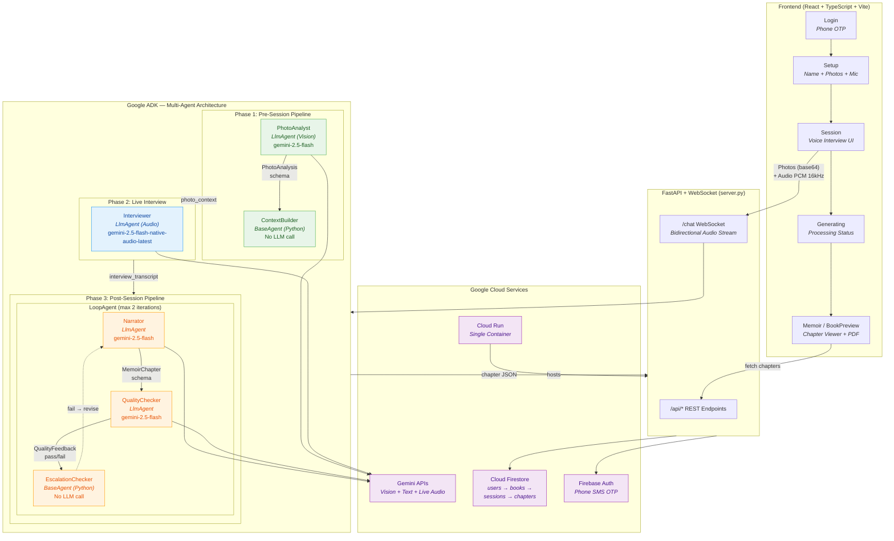
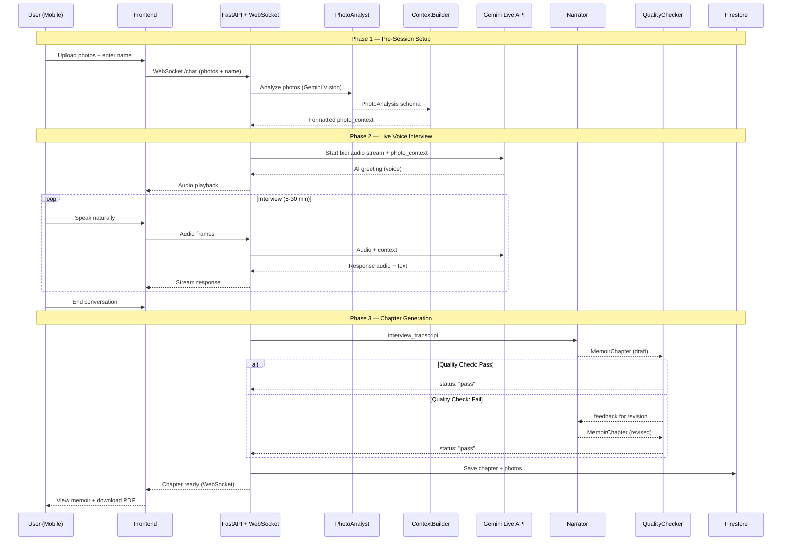

# Famoir — System Architecture

## Agent Architecture (for DevPost submission)

## Data Flow Diagram

## Agent Summary Table

| Agent | Type | Model | Role |
|-------|------|-------|------|
| **PhotoAnalyst** | LlmAgent (Vision) | gemini-2.5-flash | Analyze uploaded photos — people, era, setting, mood |
| **ContextBuilder** | BaseAgent (Python) | None | Format photo analysis into conversational cues |
| **Interviewer** | LlmAgent (Audio) | gemini-2.5-flash-native-audio-latest | Real-time voice interview via Gemini Live API |
| **Narrator** | LlmAgent (Text) | gemini-2.5-flash | Transform transcript into literary memoir chapter |
| **QualityChecker** | LlmAgent (Text) | gemini-2.5-flash | Evaluate chapter quality — pass/fail gate |
| **EscalationChecker** | BaseAgent (Python) | None | Deterministic loop control — break on pass |
| **PreSessionPipeline** | SequentialAgent | — | Orchestrates PhotoAnalyst → ContextBuilder |
| **PostSessionPipeline** | SequentialAgent | — | Wraps quality control LoopAgent |

## Tech Stack

- **Frontend:** React + TypeScript + Vite + Tailwind + shadcn/ui
- **Backend:** FastAPI + WebSocket + Google ADK
- **AI Models:** Gemini 2.5 Flash (Vision + Text + Native Audio)
- **Database:** Cloud Firestore (Native)
- **Auth:** Firebase Auth (Phone SMS OTP)
- **Deploy:** Cloud Run (single container)
- **Voice:** Gemini Live API (bidirectional audio streaming)
